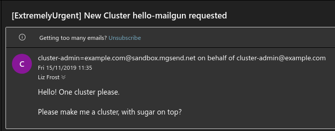

# Building, Running, Testing

## Docker Image Name

The patch in `config/manager/manager_image_patch.yaml` will be applied to the manager pod.
Right now there is a placeholder `IMAGE_URL`, which you will need to change to your actual image.

### Development Images
It's likely that you will want one location and tag for release development, and another during development.

The approach most Cluster API projects is using [a `Makefile` that uses `sed` to replace the image URL][sed] on demand during development.

[sed]: https://github.com/kubernetes-sigs/cluster-api/blob/e0fb83a839b2755b14fbefbe6f93db9a58c76952/Makefile#L201-L204

## Deployment

### cert-manager

Cluster API uses [cert-manager] to manage the certificates it needs for its webhooks.
Before you apply Cluster API's yaml, you should [install `cert-manager`][cm-install]

[cert-manager]: https://github.com/jetstack/cert-manager
[cm-install]: https://docs.cert-manager.io/en/latest/getting-started/install/kubernetes.html

```
kubectl apply -f https://github.com/jetstack/cert-manager/releases/download/<version>/cert-manager.yaml
```

### Cluster API

Before you can deploy the infrastructure controller, you'll need to deploy Cluster API itself.

You can use a precompilaed manifest from the release page, or clone [`cluster-api`][capi] and apply its manifests using `kustomize`.

``` shell
cd cluster-api
kustomize build config/ | kubectl apply -f-
```

Check the status of the manager to make sure it's running properly

```shell
$ kubectl describe -n capi-system pod | grep -A 5 Conditions
Conditions:
  Type              Status
  Initialized       True
  Ready             True
  ContainersReady   True
  PodScheduled      True
```


[capi]: https://github.com/kubernetes-sigs/cluster-api

### Your provider

Now you can apply your provider as well:

```
$ cd cluster-api-provider-mailgun
$ kustomize build config/ | envsubst | kubectl apply -f-
$ kubectl describe -n cluster-api-provider-mailgun-system pod | grep -A 5 Conditions
Conditions:
  Type              Status
  Initialized       True
  Ready             True
  ContainersReady   True
  PodScheduled      True
```

### Tiltfile
Cluster API development requires a lot of iteration, and the "build, tag, push, update deployment" workflow can be very tedious.
[Tilt](https://tilt.dev) makes this process much simpler by watching for updates, then automatically building and deploying them.

You can visit [some example repositories][capidev], but you can get started by writing out a yaml manifest and using the following [`Tiltfile`][tiltfile]
`kustomize build config/ | envsubst > capm.yaml`

[capidev]: https://github.com/chuckha/capi-dev
[tiltfile]: https://docs.tilt.dev/tiltfile_concepts.html

```starlark
allow_k8s_contexts('kubernetes-admin@kind)

k8s_yaml('capm.yaml')

docker_build('<your docker username or repository url>/cluster-api-controller-mailgun-amd64', '.')
```

You can then use Tilt to watch the logs coming off your container


## Your first Cluster

Let's try our cluster out. We'll make some simple YAML:

```yaml
apiVersion: cluster.x-k8s.io/v1alpha2
kind: Cluster
metadata:
  name: hello-mailgun
spec:
  clusterNetwork:
    pods:
      cidrBlocks: ["192.168.0.0/16"]
  infrastructureRef:
    apiVersion: infrastructure.cluster.x-k8s.io/v1alpha3
    kind: MailgunCluster
    name: hello-mailgun
---
apiVersion: infrastructure.cluster.x-k8s.io/v1alpha3
kind: MailgunCluster
metadata:
  name: hello-mailgun
spec:
  priority: "ExtremelyUrgent"
  request: "Please make me a cluster, with sugar on top?"
  requester: "cluster-admin@example.com"
```

We apply it as normal with `kubectl apply -f <filename>.yaml`.

If all goes well, you should be getting an email to the address you configured when you set up your management cluster:



## Conclusion

Obviously, this is only the first step.
We need to implement our Machine object too, and log events, handle updates, and many more things.

Hopefully you feel empowered to go out and create your own provider now.
The world is your Kubernetes-based oyster!
